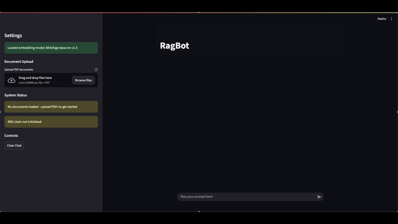

# RAG Bot

Retrieval-Augmented Generation (RAG) chatbot that lets you upload PDFs, index them locally with FAISS, and chat using Google’s Gemini models — all wrapped in a clean Streamlit UI.

## Demo




## Features

- **Document Upload & Processing**: Upload multiple PDF files for AI analysis
- **RAG-Powered Responses**: AI answers questions based on uploaded document content
- **Conversational Memory**: Maintains chat history for contextual conversations
- **Vector Store Persistence**: Saves processed documents for future sessions
- **Modern UI**: Clean, WhatsApp-inspired chat interface
- **Real-time Processing**: Live document processing with progress indicators


## Installation

### Prerequisites
- Python 3.8+
- Google API key for Gemini model

### Setup Steps

1. **Clone the repository**
   ```bash
   git clone https://github.com/ShivamMishra1603/rag-bot
   cd rag-bot
   ```

2. **Install dependencies**
   ```bash
   pip install -r requirements.txt
   ```

3. **Environment Configuration**
   Create a `.env` file in the root directory:
   ```env
   GOOGLE_API_KEY=your_google_api_key_here
   ```

4. **Run the application**
   ```bash
   streamlit run app.py

## Usage

### Getting Started

1. **Launch the Application**
   ```bash
   streamlit run app.py
   ```

2. **Upload Documents**
   - Use the sidebar to upload one or more PDF files
   - Click "Process Documents" to create the vector store

3. **Start Chatting**
   - Ask questions about your uploaded documents
   - The AI will provide answers based on the document content

### System Status Indicators

The sidebar shows real-time system status:
- **Vector Store**: Shows if documents are loaded and ready
- **RAG Chain**: Indicates if the conversational system is active
- **Controls**: Clear chat history and reset memory


## File Structure

```
rag-bot/
├── app.py                 # Main Streamlit application
├── requirements.txt       # Python dependencies
├── .env                   # Environment variables (create this)
├── src/                   # Core application modules
│   ├── chain.py           # RAG chain implementation
│   ├── embeddings.py      # Embedding management
│   ├── loaders.py         # Document processing
│   └── vectorstore.py     # Vector database operations
├── vectorstore/           # Persistent vector storage (auto-created)
│   ├── faiss_index.faiss  # FAISS index file (auto-generated)
│   ├── faiss_index.pkl    # FAISS metadata file (auto-generated)
└── README.md              # This file
```

### Core Components

#### Component Details
#### `app.py` - Main Application
The Streamlit-based web interface that orchestrates all components:
- **Chat Interface**: WhatsApp-style messaging UI with timestamps
- **Document Upload**: PDF file upload and processing workflow
- **RAG System Setup**: Initializes and manages the RAG pipeline
- **Session Management**: Handles chat history and system state


#### `src/embeddings.py` - Embedding Management
Handles text vectorization using HuggingFace embeddings:
- **Model**: `BAAI/bge-base-en-v1.5` (base English model)
- **Configuration**: CPU-based processing with normalized embeddings
- **Caching**: Streamlit resource caching for performance

#### `src/loaders.py` - Document Processing
Manages PDF document loading and text chunking:
- **PDF Processing**: Uses PyPDFLoader for document extraction
- **Text Splitting**: Recursive character-based splitting
- **Chunk Configuration**:
  - Default chunk size: 1000 characters
  - Overlap: 200 characters
  - Smart separators: `["\n\n", "\n", " ", ""]`
- **Metadata Preservation**: Maintains source file information

#### `src/chain.py` - Conversational RAG Chain
Implements the core conversational retrieval system:
- **ConversationalRAGChain**: Main class managing the RAG pipeline
- **Google Gemini Integration**: Uses `Gemini` model for responses
- **Memory Management**: Conversation buffer with configurable window size
- **Custom Prompting**: Tailored prompts for document-based Q&A


#### `src/vectorstore.py` - Vector Database
Manages FAISS vector store operations:
- **FAISS Integration**: Facebook AI Similarity Search for vector storage
- **Persistence**: Save/load vector stores to/from disk
- **Document Management**: Add new documents to existing stores
- **Retrieval**: Configurable similarity search (default: top-4 results)


## Dependencies

### Core Libraries
- **streamlit**: Web application framework
- **langchain**: LLM application framework
- **langchain-community**: Community integrations
- **langchain-google-genai**: Google Generative AI integration
- **langchain-huggingface**: HuggingFace embeddings integration

### Processing Libraries
- **sentence-transformers**: Sentence embedding models
- **pypdf**: PDF document processing
- **faiss-cpu**: Vector similarity search
- **python-dotenv**: Environment variable management


## Configuration

### Model Settings
- **LLM Model**: `gemini-1.5-flash` (configurable in `chain.py`)
- **Temperature**: 0.7 (controls response creativity)
- **Memory Window**: 10 messages (conversation history)

### Embedding Settings
- **Model**: `BAAI/bge-base-en-v1.5`
- **Device**: CPU (configurable for GPU)
- **Normalization**: Enabled for better similarity matching

### Document Processing
- **Chunk Size**: 1000 characters
- **Chunk Overlap**: 200 characters
- **Supported Formats**: PDF files only

### Vector Store
- **Backend**: FAISS (Facebook AI Similarity Search)
- **Persistence**: Local disk storage in `vectorstore/` directory
- **Retrieval**: Top-4 similar documents per query


## Error Handling

The application includes comprehensive error handling:
- **Document Processing**: Graceful handling of corrupt PDFs
- **API Failures**: Fallback messages for API issues
- **Vector Store**: Error recovery for storage operations
- **Memory Management**: Automatic cleanup and reset options


## Troubleshooting

### Common Issues

1. **"GOOGLE_API_KEY not found"**
   - Ensure `.env` file exists with valid API key

2. **"No vector store available"**
   - Upload and process documents first

3. **"Error processing PDF"**
   - Check if PDF is not corrupted or password-protected

4. **Memory issues with large documents**
   - Reduce chunk size or process fewer documents at once

